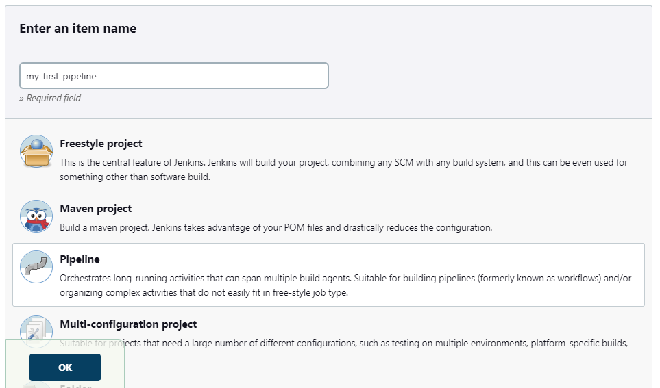
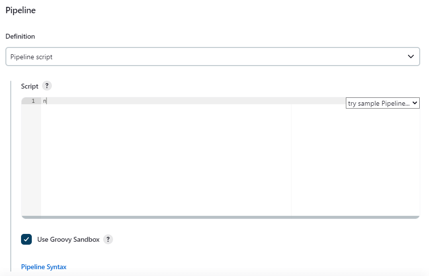

# Docker for some projects

## Docker with Ansible

### Build the image
```sh
# In path/to/the/repo/
# Build the image with the tag name ansible-controller
docker build -t ansible-controller ansible/ansible_controller/
```
### Check if the controller is working
Structure of the directory shared while running the container :
```sh
# Structure of the targeted directory
ansible/ansible_volumes/init_volume/
└── init-playbook.yml
```
First, let explain the commands:
- **```docker run```** : basic command to run the container
- **```--rm```** : it will delete the container after completing the command
- **```-v $(pwd)/ansible/ansible_volumes/init_volume:/ansible_files```** : The content of the directory init_volume from the host will be shared with the directory ansible_files from the container
- **```ansible-controller```** : the name we set when building the image (see above)
- **```ansible-playbook -i "my-local-node," --connection=local init-playbook.yml```** : ansible-playbook command (for more details, check [here](https://docs.ansible.com/ansible/latest/cli/ansible-playbook.html))
```sh
# In path/to/the/repo/
# Command to run the container
# It will launch the playbook at the same time
docker run \
--rm \
-v $(pwd)/ansible/ansible_volumes/init_volume:/ansible_files \
ansible-controller \
ansible-playbook -i "my-local-node," --connection=local init-playbook.yml
```
### Interact with the Docker host
The following steps will permit us to interact with the docker host where the ansible-controller container is running.

Structure of the directory shared while running the container :
```sh
# Structure of the targeted directory
ansible/ansible_volumes/host_interaction/
├── ansible.cfg
├── host-int-playbook.yml
└── inventory
    ├── 00_inventory.yml
    └── host_vars
        ├── my-docker-host.yml
        └── my-local-node.yml
```
Concerning the ansible.cfg file, there is a very interesting webpage [here](https://www.golinuxcloud.com/ansible-cfg/) on the basis of its content.

#### What changes compare to an ansible controller set up on a VM ?
For the moment, 2 ocurring errors were found :
- **Prompt command is not working** : the ansible options -k, -K are not working
***Resolved*** : Put everything in variables. For sensitive ones, it will be explained in the ansible-vault chapter
- **Fingerprint check not working** : *host_key_checking = False* option in ansible.cfg not working
***Resolved*** : Add **ansible_ssh_extra_args: '-o StrictHostKeyChecking=no'** for the concerned hosts

#### Let's try our Ansible controller container
For your configuration, let's change few things. We will work in remote and your IP, user and password are not the same.
- Modify *my-docker-host.yml* file
```sh
# In path/to/the/repo/
cat ansible/ansible_volumes/host_interaction/inventory/host_vars/my-docker-host.yml
# It should look like this
---
my_var: "my-docker-host"
ansible_host: <IP of the docker host>
ansible_connection: ssh
ansible_user: "<username on your docker host>"
ansible_password: "<Password of the username>"
ansible_ssh_extra_args: '-o StrictHostKeyChecking=no'
```
**WARNING** : Displaying your password like that is not secure at all. Don't worry, we will fix that later.
- Run the ansible-controller container
In the playbook, we changed one of the tasks:
```sh
- name: Catch the linux distribution of the host
      shell: ls
      register: MY_DISTRIB
```
Instead of giving us the distribution, it will display the list of files from the /ansible_files drectory for the container and from your home directory for your docker host.
```sh
# In path/to/the/repo/
docker run \
--rm \
-v $(pwd)/ansible/ansible_volumes/host_interaction:/ansible_files \
ansible-controller \
ansible-playbook host-int-playbook.yml
```
```sh
# The ouput should look like that
TASK [Display the linux distribution] ******************************************
ok: [my-local-node] => {
    "msg": "ansible.cfg\nhost-int-playbook.yml\ninventory"
}
ok: [my-docker-host] => {
    "msg": "docker-for-projects\n<...>"
}
```
### Hide your secrets with Ansible-Vault
In this part , we will go through the following steps:
- Put our sensitive variables in the vault.yml file
- Encrypt the vault file via the container
- Launch the playbook using the option --vault-password-file

#### Structure of the sharing volume
- Global structure of the volume
```sh
ansible/ansible_volumes/vault_process/
├── ansible.cfg
├── host-int-playbook.yml
└── inventory
    ├── 00_inventory.yml
    ├── group_vars
    │   └── all
    │       ├── variables.yml
    │       └── vault.yml
    └── host_vars
        ├── my-docker-host.yml
        └── my-local-node.yml
```
- Modification of vault.yml and my-docker-host.yml files
  
-> **vault.yml** file

```sh
# ansible/ansible_volumes/vault_process/inventory/group_vars/all/vault.yml
---
vault_docker_pass: "<docker host password>"
vault_docker_user: "<docker host user>"
```
-> **my-docker-host.yml** file

```sh
# ansible/ansible_volumes/vault_process/inventory/host_vars/my-docker-host.yml
---
my_var: "my-docker-host"
ansible_host: <IP of the docker host>
ansible_connection: ssh
ansible_user: "{{ vault_docker_user }}"
ansible_password: "{{ vault_docker_pass }}"
ansible_ssh_extra_args: '-o StrictHostKeyChecking=no'
```

#### Simple way
- Setup the password in a secure way
First you will create a directory with your file and a password in it at your home location
```sh
# Create the directory
mkdir ~/.my_secrets
# Create the password file
cat > ~/.my_secrets/my-vault
# Input : Put yur password
<my-password>
```
- Encryption of the vault.yml file containing the sensitive informations

First, we will go through an explanation about this command :

-> **```-v ~/.my_secrets:/secrets```** : Volume sharing creating a /secrets directory in the container

-> **```ansible-vault encrypt --vault-id /secrets/my-vault inventory/group_vars/all/vault.yml```** : Encrypt a file using a file as password storage (for more explanation about ansible-vault, check [here](https://docs.ansible.com/ansible/latest/user_guide/vault.html))

```sh
# In path/to/the/repo/
docker run \
--rm \
-v ~/.my_secrets:/secrets \
-v $(pwd)/ansible/ansible_volumes/vault_process:/ansible_files ansible-controller \
ansible-vault encrypt --vault-id /secrets/my-vault inventory/group_vars/all/vault.yml
```
- Start the playbook with the vault.yml file encrypted
```sh
# In path/to/the/repo/
docker run \
--rm \
-v ~/.my_secrets:/secrets \
-v $(pwd)/ansible/ansible_volumes/vault_process:/ansible_files ansible-controller \
ansible-playbook vault-playbook.yml --vault-password-file /secrets/my-vault
```
We will see later that we could use an other way passing by jenkins.

### Deploy ssh keys from the Ansible container
As the container is deleted afetr ech use, I don't know if it's very useful. However, I will explain how it could be done.

#### Structure of the shared volume
- Global structure of the volume
```sh
ansible/ansible_volumes/ssh_key_generate/
├── ansible.cfg
├── inventory
│   ├── 00_inventory.yml
│   └── host_vars
│       ├── my-docker-host.yml
│       └── my-local-node.yml
└── ssh-playbook.yml
```
- Modifications on the host_vars directory
Do the same than we did previously.

#### Command to launch the playbook
```sh
# In path/to/the/repo/
docker run \
--rm \
-v $(pwd)/ansible/ansible_volumes/ssh_key_generate:/ansible_files \
ansible-controller ansible-playbook ssh-playbook.yml
```
The output should look like this:
```sh
PLAY [all] *********************************************************************

TASK [Create the .ssh directory in the container] ******************************
changed: [my-local-node -> 127.0.0.1]

TASK [generate SSH key] ********************************************************
changed: [my-local-node -> 127.0.0.1]

TASK [Deploy public key] *******************************************************
changed: [my-local-node -> my-docker-host(<docker host IP>)]

PLAY RECAP *********************************************************************
my-local-node              : ok=3    changed=3    unreachable=0    failed=0    skipped=0    rescued=0    ignored=0
```

## Docker with Jenkins

### Setup the jenkins container and its interface
There are already a plenty of tutorials about this kindof setup. Here one from [Digital Ocean](https://octopus.com/blog/jenkins-docker-install-guide)

#### Pull the jenkins container
To see more details about this image check [here](https://hub.docker.com/r/jenkins/jenkins)
```sh
# Download the docker image from DockerHub
docker pull jenkins/jenkins:lts
```

#### Create a persistent volume

-> **Create a Docker volume**
```sh
docker volume create jenkins_tutorial
```

-> **Location of this volume using the command** ``` docker inspect ```
```sh
docker inspect jenkins_tutorial
```
You will get an output like this:
```sh
[
    {
        "CreatedAt": "2022-11-09T03:46:21-05:00",
        "Driver": "local",
        "Labels": {},
        "Mountpoint": "/var/lib/docker/volumes/jenkins_tutorial/_data",
        "Name": "jenkins_tutorial",
        "Options": {},
        "Scope": "local"
    }
]
```
Just to know how to navigate in this JSON-like output, here the command to get only the result we need (ideal for bash scripts or pipeline scripts) :
```sh
docker inspect -f '{{ .Mountpoint }}' jenkins_tutorial
```

-> **Start the Jenkins container**

- **```-d```** : Run the container in detach mode (No display of the container output)
- **```--restart always```** : Always restart unless it was stopped manually
- **```-p 8081:8080```** : Link the port 8080 of the container to the port 8081 of the host
- **```-p 50000:50000```** : This is something about jenkins agent, but honestly I didn't find any concrete reason
- **```-v jenkins_tutorial:/var/jenkins_home```** : Share a volume docker with the container

```sh
docker run \
-d \
--restart always \
--name my-jenkins \
-p 8081:8080 \
-p 50000:50000 \
-v jenkins_tutorial:/var/jenkins_home \
jenkins/jenkins:lts
```
-> **How to get the initial password with the command** ```docker exec```

This command will display the initial password asked when you display the jenkins page on the browser at the URL <docker host IP>:8081
```sh
docker exec my-jenkins cat /var/jenkins_home/secrets/initialAdminPassword
```
For the next installation steps, you can use this tutorial from [Digital Ocean](https://octopus.com/blog/jenkins-docker-install-guide).

### Setup Jenkins via the interface

#### Additionnal plugins to install
    
| Plugin | Version | Purpose |
| ------ | ------ | ------ |
| **Ansible plugin** | [1.1](https://plugins.jenkins.io/ansible/) | Ansible interaction |
| **Docker plugin** | [1.2.10](https://plugins.jenkins.io/ansible/) | Set up docker Cloud and API |
| **Docker Pipeline** | [528.v7](https://plugins.jenkins.io/docker-workflow/) | Integrate docker objects for pipelines |
| **Locale** | [v204.v2](https://plugins.jenkins.io/locale/) | Setup the interface language |
| **docker-build-step** | [2.9](https://plugins.jenkins.io/docker-build-step/#documentation) | Plugin to try |
| **Blue Ocean** | [1.25.8](https://plugins.jenkins.io/blueocean) | Better visualization of the pipeline|
    
#### Setup the docker host as node

First you need to install jdk-11, check the installation on different distributions : [Ubuntu 18.04](https://www.infoworld.com/article/3514725/installing-oracle-java-se-11-on-ubuntu-18-04.html), [Rocky Linux 8, CentOS 8, RHEL 8](https://computingforgeeks.com/how-to-install-java-11-openjdk-11-on-rhel-8/)

-> **Steps to setting the node**

- Go to **Manage Jenkins** > **Manage Nodes and Clouds** > **New Node**

- Name of the new node


- Directory where the job will be deployed


- Labels to help filter the node we need


- Launch type to link the node to jenkins


For further details check a documentation [here](https://anto.online/code/how-to-create-a-node-agent-in-jenkins/).

### Our first scripted pipeline in the Docker node

#### Simple script

- Go to **Dashboard** > **New Item**
- Create a Pipeline

- Go to **Configuration** > **Pipeline**

- Insert the following code in the pipeline script
```sh
// Start the job in the chosen node
// Here we choose to filter by label 'docker'
node ('docker') {
    // First step of the pipeline, you can give the name you want
    stage ('First Step') {
        //pipeline integrated command
        echo "Hello World"
    }
    // Second step of the pipeline, you can give the name you want
    stage ('Second Step') {
        //sh command
        sh "echo Hello World"
    }
}
```
-> You can see that a directory was added to the jenkins workspace
```sh
~/jenkins-agent/workspace/workspace/
├── my-first-pipeline
└── my-first-pipeline@tmp
```
For more details about what you can do with scripted pipelines, check a guide [here](https://github.com/sofackj/jenkins-scripted-pipeline.git). It's not complete yet but it's enough for what we have to do.

#### Running the playbook in the container

I encountered **Permissions errors** while executing the pipeline. This issue was resolved, by going inside the container as root user. 

**WARNING** : The best way should be to add a user when building the image and execute all command with this user.

 An other possible resolution Permission errors in ansible container [here](https://stackoverflow.com/questions/49720135/ansible-playbook-permission-denied) 

```sh
// Start the job in the chosen node
// Here we choose to filter by label 'docker'
node ('docker') {
    // Delete the workspace then rebuild it
    stage ('Clean the worspace') {
        // Class to delete the workspace direcory
        cleanWs()
    }
    // Define variables for all the pipeline
    // Using 'def' in a stage would limit the use of this variable in it
    stage ('Environment variables') {
        // Variable for the ansible playbook directory
        env.ANSIBLE_DIR = "ansible/ansible_volumes/ssh_key_generate"
        // Variable for the ansible playbook name
        env.ANSIBLE_PLAYBOOK = "ssh-playbook.yml"
        // Variable for the git repository
        env.GIT_REPO = 'https://github.com/sofackj/docker-for-projects.git'
    }
    // Import the git repository
    stage ('Cloning of the repository') {
        // Git pipeline integrated command
        git (
            // Branch of the repository to import
            branch: 'main',
            // Credentials for github setup in jenkins (username/token)
            credentialsId: 'my-github-token',
            // Url of the repository
            url: 'https://github.com/sofackj/docker-for-projects.git'
            )
    }
    // STart the ansible playbook in the Ansible container
    stage ('Launch of the Playbook') {
        // Docker pipeline integrated command
        docker
        // Name of the image to use
        .image('ansible-controller')
        // Property to do commands inside tha container
        // Go inside as root to avoid permission errors
        .inside('-u root'){
            // Go to the existing directory (if no directory, it will create one)
            dir("${ANSIBLE_DIR}"){
                // ansiblePlaybook invoke via jenkins
                ansiblePlaybook(
                    // Path of the playbook but other options can be added
                    playbook: "${ANSIBLE_PLAYBOOK}"
                )
            }
        }
    }
}
```

#### Jenkins asking password for Ansible-Vault

This is an example to show the use of Ansible-Vault with jenkins without leaking the password within the code. I won't explain all the steps of the process given that this method was explained in one of my tutorials [Ansible-Vault for Jenkins](https://github.com/sofackj/jenkins-scripted-pipeline#ansible-vault-for-jenkins)

Here the structure of our aimed directory :
```sh
ansible/ansible_volumes/vault_process/
├── ansible.cfg
├── inventory
│   ├── 00_inventory.yml
│   ├── group_vars
│   │   └── all
│   │       ├── variables.yml
│   │       └── vault.yml
│   └── host_vars
│       ├── my-docker-host.yml
│       └── my-local-node.yml
├── secrets
└── vault-playbook.yml
```
Two actions will be executed in the container :
- Encrypt the ```group_vars/all/vault.yml```
- Start the ```vault-playbook.yml``` with few variables encrypted

**To Be Clear** : In this case, whatever the password you enter. For your project you have to encrypt your ```vault.yml``` file before its commit to your git remote repository.

```sh
// Start the job in the chosen node
// Here we choose to filter by label 'docker'
node ('docker') {
    // Delete the workspace then rebuild it
    stage ('Clean the worspace') {
        // Class to delete the workspace direcory
        cleanWs()
    }
    // Define variables for all the pipeline
    // Using 'def' in a stage would limit the use of this variable in it
    stage ('Environment variables') {
        // Variable for the ansible playbook directory
        env.ANSIBLE_DIR = "ansible/ansible_volumes/vault_process"
        // Variable for the ansible playbook name
        env.ANSIBLE_PLAYBOOK = "vault-playbook.yml"
        // Variable for the git repository
        env.GIT_REPO = 'https://github.com/sofackj/docker-for-projects.git'
        // Variable generating a sensitive file
    }
    // Import the git repository
    stage ('Cloning of the repository') {
        // Git pipeline integrated command
        git (
            // Branch of the repository to import
            branch: 'main',
            // Credentials for github setup in jenkins (username/token)
            credentialsId: 'my-github-token',
            // Url of the repository
            url: 'https://github.com/sofackj/docker-for-projects.git'
            )
    }
    // Start the ansible playbook in the Ansible container
    stage ('Processus running in the Ansible container') {
        // Docker pipeline integrated command
        docker
        // Name of the image to use
        .image('ansible-controller')
        // Property to do commands inside tha container
        // Go inside as root to avoid permission errors
        .inside('-u root'){
            // Go to the existing directory (if no directory, it will create one)
            dir("${ANSIBLE_DIR}"){
                // Create a file secrets with password in it
                writeFile (
                    file: 'secrets',
                    text: VAULT
                )
                // Encrypt the vault file with the secrets file
                sh "ansible-vault encrypt inventory/group_vars/all/vault.yml --vault-id secrets"
                // ansiblePlaybook invoke via jenkins
                ansiblePlaybook (
                    // Path of the playbook but other options can be added
                    playbook: "${ANSIBLE_PLAYBOOK}",
                    extras: "--vault-pass-file secrets"
                )
            }
        }
    }
}
```

####